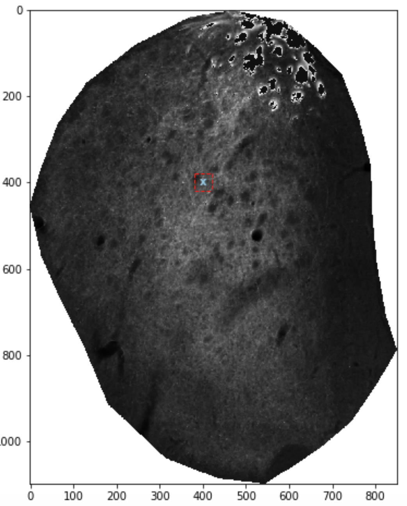
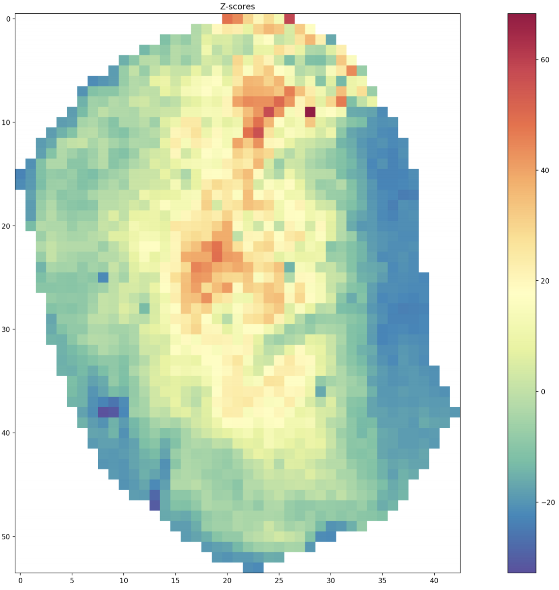

# Hotspot Analysis
**Spatial autocorrelation analysis for microscope images**

This analysis pipeline uses the Getis-Ord Gi statistic (Getis & Ord, 1992) to measure spatial autocorrelation of pixel intensity values across a microscope image. The Gi statistic is commonly referred to as "Hotspot Analysis." The premise of this analysis is explained below.

In hotspot analysis, we are interested in the density of pixel values in a specified area of an image. In
other words, for a given area of pixels, we are asking: is the sum of pixels values more, or less, or equal to the
sum you would expect if all the pixels in the image were randomly distributed throughout the image?

For example, perhaps we would like to see if the below 200pixel by 200pixel areas of our image
(hereafter referred to as neighborhoods), A and B, contain higher or lower pixel values, on average, than you
would expect by chance:

By chance, we mean if we took all the pixels in the entire image and randomly scattered them
throughout the entire image:

The mean pixel value for both images is the same, because they are comprised of the same pixels. We
will refer to this mean as the global mean.

If you took the mean pixel value for every 200x200 pixel neighborhood (local means) in the actual and
randomly scattered images:

and plotted the distribution of local means:

you would find that in the randomly scattered image (right histogram), the distribution is centered around the
average pixel value of the entire image (the global mean; black dotted line) and is roughly normally distributed.
In the actual image (left histogram), however, the distribution is skewed to the right. This is because there are
certain neighborhoods that have significantly higher pixel density than the global mean. You also have many
neighborhoods that are almost completely black, whose local means are significantly less than the global mean;
these neighborhoods are contributing to the leftmost peak in the distribution. And since the most likely local
mean to sample in a randomly scattered image is the global mean, we will be comparing the local means of all
the neighborhoods in the actual image to the global mean, which is the mean we would expect in an image with
randomly distributed pixels (the null hypothesis).

------------------------------

## Getis Ord Gi Statistic

This statistical method calculates the density of pixel values within a neighborhood, Gi, and the expected
density of pixel values under the null hypothesis, E(Gi). It then uses those two values along with the variance of
the dataset to create a Z-score, which can be used to discern the likelihood that the observed level of pixel
clustering within a neighborhood is likely to have occurred by chance. The Gi statistic is explained below:

The expected value of a given pixel under the null hypothesis of spatial randomness is the global mean
pixel value:

Then, the expected Gi statistic within any given neighborhood is:

The actual density of pixel values within a neighborhood is calculated as:

The Z-score comparing the expected and actual Gi statistics is calculated as:

But we are interested in only a sub-portion of the above image; using the entire image biases the results because
of all the empty space around the tissue section, and really, because of all the pixel values outside of the region
of interest (ROI). We also need to remove the saturated pixels that comprise the corticospinal axon bundles;
those pixel values also bias the results of our analysis. To deal with saturated pixels, we take all the pixels
whose value is above some threshold value and replace them with the global mean:

To deal with the ROI problem, we create a non-rectangular mask by manually drawing vertices around
the shape we are interested in, and we exclude all pixels that are outside of the mask (by making those pixels
equal to NaN – not a number):

The above plot on the right is the final image that we run the hotspot analysis on. First, we choose
the size of the neighborhoods we would like to use. We will choose 20x20 pixels for this analysis but that is an
arbitrary choice. An example 20x20 neighborhood would look like the following:

We calculate the Gi statistic (and subsequently, Z-score) for every non-overlapping 20x20 sized
neighborhood. This allows us to create a map of the original image but using the statistic associated with each
neighborhood. In the following images are results from the analysis described above. The first image has each
neighborhood plotted over the original image with its respective Z-score. The size of each circle is proportional
to the magnitude of the Z-score, and the color represents whether the Z-score is positive (salmon) or negative (
light blue). The second has the neighborhoods plotted instead of the original image, using a heatmap to
represent the Z-scores of each neighborhood.

The analysis produces a data table of the following data:

where:
- **x & y** are the coordinates of the center of the neighborhood
- **nx & ny** are the dimensions of the neighborhood
- **Star** is whether the statistic is the Gi* or Gi type (1 or 0), details in Getis & Ord, 1992
- **Mean, Variance, & SD** are characteristics of the entire image
- **Z-Score & p-value** are of the given neighborhood
- **Sign** represents the sign of the Z-Score (+ or -)

The above information provides us with great flexibility with our data. For example, since we know the
location of each neighborhood, we can break the image into four quadrants by cutting it down the middle both
vertically and horizontally and pick out the neighborhoods that belong to each. These four quadrants can
represent the dorsomedial (DM), dorsolateral (DL), ventromedial (VM), and ventrolateral (VL) portions of the
striatum. We can then plot the distributions of their Z-scores. If there is a quadrant that has higher clustering
than the others, we would expect the distribution of that hemisphere to be right-skewed. That is exactly what we
see with the DM region, and calculation of the standard deviation of Z-scores confirms this:

Using this method, we can assess clustering within an image and compare across spatial axes within a
mouse brain, across different markers within an animal, across brains of different ages, after conducting a
manipulation (e.g. gene overexpression/knockdown), etc.

Getis A., Ord JK. The Analysis of Spatial Association by Use of Distance Statistics. *Geographical Analysis*. 1992.
